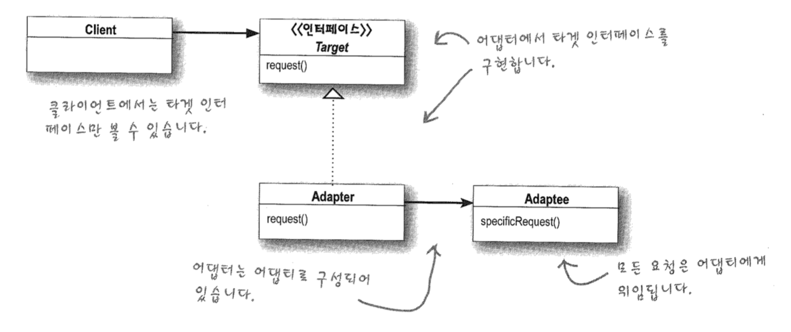

# Adaptor Pattern

한 클래스의 인터페이스를 클라이언트에서 사용하고자 하는 다른 인터페이스로 변환한다

어댑터를 이용하면 인터페이스 호환성 문제 때문에 같이 쓸 수 없는 클래스들을 연결해서 쓸 수 있다





```
public class MallardDuck inplements Duck{
	public void quack(){
		...
	}
	
	public void fly(){
		...
	}
}
```

```
public class WildTurkey implements Turkey{
	public void gobble(){
	 ...//터키는 꽥꽥 대신 골골 
	}

	public void fly(){
	 ...//터키는 오리보다 잘 못남
	}
}
```

```
public class TurkeyAdaptor implements Duck{//적응시킬 형식의 인터페이스 구현
	Turkey turkey;
	
	public TurkeyAdaptor(Turkey turkey){//생성자로 원래 형식의 객체에 대한 레퍼런스 필요
		this.turkey = turkey;
	}
	
	public void quack(){
		turkey.goble(); //quack를 대신해서 goble() 호출
	}
	
	public void fly(){
		for(int i=0; i<5; i++)
			turkey.fly(); //터키는 오리보다 잘 못날아서 turkey.fly() 반복 호출
	}
} 
```

#### Adaptor 만들기

1. 적응시킬(Duck) 형식의 인터페이스 구현
2. 생성자로 원래 형식의 객체(Turkey)에 대한 레퍼런스 받아오기
3. 적응시킬 형식의 메소드를 원래 형식의 객체 메소드로 재구현


# Facade Pattern

하나 이상의 클래스의 복잡한 인터페이스를 깔끔하면서도 말쑥한 퍼사드(겉모양, 외관)로 덮어준다

어떤 서브시스템의 일련의 인터페이스에 대한 통합된 인터페이스를 제공한다. 퍼사드에서 고수준 인터페이스를 

정의하기 때문에 서브시스템을 더 쉽게 사용할 수 있다.


#### Adaptor 

- 하나 이상의 클래스의 인터페이스를 클리언트에서 필요로 하는 인터페이스로 변환
- 인터페이스를 변경해서 클라이언트에서 필요로 하는 인터페이스로 적응시키기 위한 용도

#### Facade

- 아주 복잡한 인터페이스를 가지고 있는 단 한개의 클래스에 대해서 퍼사르를 만들 수 있음
- 어떤 서브 시스템에 대한 간단한 인퍼테이스 제공 용도
- 서브 시스템을 ''활용'' 뿐만 아니라 ''기능 추가''도 가능


### *객체지향 원칙 최소 지식 원칙

정말 친한 친구하고만 얘기하라 - 객체 사이의 상호작용은 될 수 있으면 하주 가까운 "친구" 사이에서만 허용하는 것이 좋다

-> 어떤 객체든 그 객체와 상호작용을 하는 클래스의 개수에 주의해야 하며

-> 그런 객체들과 어떤 식으로 상호작용을 하는지에도 주의해야 한다


#### Q. 친구는 만들지 않으면서 다른 객체에 영향력을 행사하는 방법?

- 객체 자체
- 메소드에 매개변수로 전달된 객체
- 그 메소드에서 생성하거나 인스턴스를 만든 객체
- 그 객체에 속하는 구성요소(인스턴스변수에 의해 참조되는 객체)

```
//원칙을 따르지 않은 경우
public float getTemp(){
	Thermometer thermometer = station.getThermometer();
	return thermometer.getTemperature();
}
```

```
//원칙을 따르는 경우
public float getTemp(){
	//객체 쪽에 대신 요청 -> 의존하는 클래스의 개수를 줄일 수 있다
	return station.getTermometer.getTemperature(); }
```

