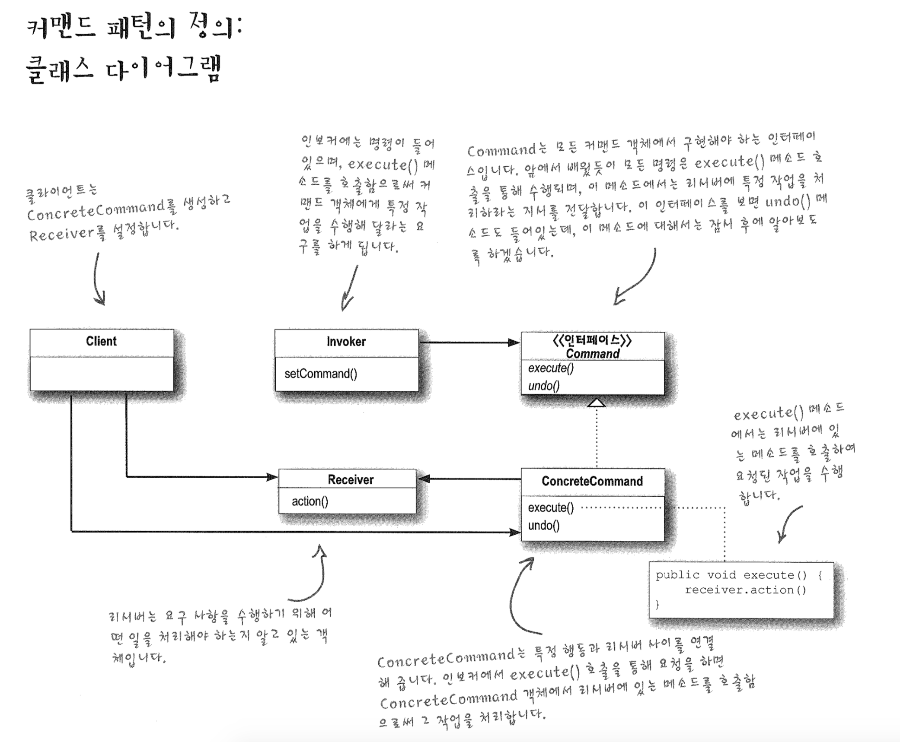

# Comman Pattern

커맨드 패턴을 이용하면 요구 사항을 객체로 캡슐화할 수 있으며, 매개변수를 써서 여러 가지 다른 요구 사항을

집어넣을 수도 있습니다. 또한 요청 내역을 큐에 저장하거나 로그로 기록할 수도 있으며, 작업취소 기능도 지원 가능합니다.





```
public class LightCommand implements Command{
	Light light; // receiver
	
	//생성자에 이 커맨드 객체로 제어할 특정 객체를 전달
	public LightCommand(Light light){
		this.light = light;
	}
	
	//action()
	public void execute(){
		light.on();
	}
}
```

```
public class SimpleRemoteControl{
	Command slot;
	
	public SimpleRemoteControl(){}
	
	public void setCommand(Command command){
		slot = command;
	}
	
	public void buttonClicked(){
		slot.executed();
	}
}
```

```
public class RemoteControlTest{
	public static void main(String[] args){
		SimpleRemoteControl remote = new SimpleRemoteControl(); //invoker 역할
		Light light = new Light();
		LightCommand lightOn = new LightOnCommand(light);// receiver 전달
		
		remote.setCommand(lightOn);//command 객체 전달
		remote.buttonClicked();
	}
}
```

