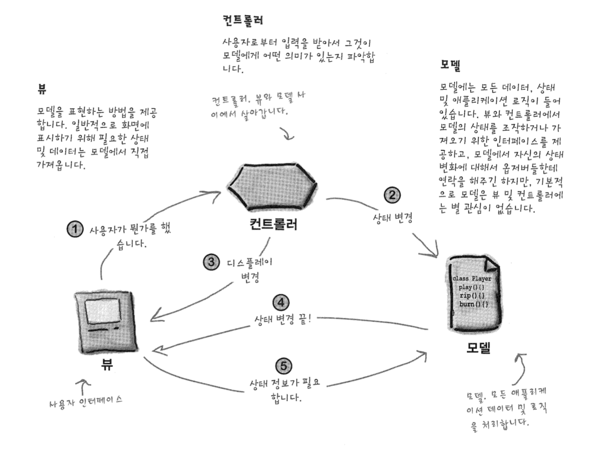

# Compound Pattern

반복적으로 생길 수 있는 일반적인 문제를 해결하기 위한 용도로 두 개 이상의 패턴을 결합해서 사용하는 것


---------------

꽥! 하고 울음 소리를 낼 수 있는 오리 객체를 하나 만들어 보자!

```java
public class MallardDuck implements Quackable {
	public void quack(){
		System.out.println("Quack");
	}
}
```

```java
void simulate(Quackable duck) {
	duck.quack();
}
```

다형성으로 Quackable 객체를 파라미터로 받아 quack() 메소드를 호출하는 로직도 추가하자


원래 오리와 거위는 서로 잘 몰려 다니는 친구라고 한다

그래서 오리가 들어갈 수 있는 곳에는 거위도 넣으려고 한다

```java
public class Goose {
	public void honk(){
	 //...
	}
}
```

하지만 거위는 오리 객체의 형식과는 조금 다른 모양새를 가진 상태이다

거위를 오리인척 사용하고 싶다면 어떤 패턴을 이용해야 할까?


```java
//Adaptor Pattern
public class GooseAdapter implements Quackable {
	Goose goose;
	
	public GooseAdapter(Goose goose){
		this.goose = goose;
	}
	
  //goose의 honk()를 duck의 quack에 대응할 수 있도록!
	public void quack(){
		goose.honk();
	}
}
```

--> adapter pattern을 사용하여 Quackable의 quack()이 불렸을 때,

Goose의 honk() 를 호출하도록 로직을 변경!


```java
void test() {
	Quackable mallardDuck = new MallardDuck();
	Quackable gooseDuck = new GooseAdapter(new Goost());
	
	simulate(mallardDuck);
	simulate(gooseDuck);
}
```

이제 거위들도 오리와 어울릴 수 있게 되었다!


----------------

오리떼가 호수에 있을 때, 오리떼가 낸 꽥 소리의 총 횟수를 알고 싶다면?

어떤 패턴을 이용하면 위의 기능을 구현할 수 있을까?


```java
//Decorator Pattern
public class QuackCounter implements Quackable {
	Quackable duck; // 감싸고자 하는 객체의 레퍼런스
  static int numberOfQuacks;
  
  public QuackCounter(Quackable duck){
    this.duck = duck;
  }
  
  // Quackable의 quack의 기능에 count 기능을 추가
  public void quack(){
    duck.quack();
    numberOfQuacks++; 
  }

  public static int getQucakCount(){
    return numberOfQuack;
  }
}
```

Quackable을 감싼 QuackCounter를 구현함으로써 이 문제를 해결할 수 있다

QuackCounter.quack()는 Quackable의 quack() 뿐만 아니라 꽥 소리의 카운트를 증가 시킨다

사용하는 사용자 입장에서는 Quackable로 사용하기 때문에(다형성) 내부적인 구현을 알 필요가 없게되고

우리는 원하는 기능을 구현할 수 있게 되었다


----

오리 객체를 생성하는 작업을 한 군데에서 몰아서 하고 싶을때는 어떻게 해야할까?


```java
// Factory Pattern
public abstract class AbstractDuckFactory {
	public abstract Quackable createMallardDuck();
	public abstract Quackable createRedheadDuck();
}
```

```java
public class CountingDuckFactory extends AbstractDuckFactory {
	public abstract Quackable createMallardDuck(){
  	return new QuackCounter(new MallardDuck());  
  }
  
	public abstract Quackable createRedheadDuck(){
    return new QuackCounter(new RedheadDuck());
  }
}
```

```java
public class CountingGooseFactory extends AbstractGooseFactory {
  public abstract Quackable createGoose(){
    return new QuackCounter(new GooseAdapter(new Goose()));
  }
}
```

추상 팩토리를 사용하여 한 곳에서 오리 객체들을 생성할 수 있다


----

더 나아가, 이 많은 오리들을 한번에 관리할 수 있는 방법은 없을까?


```java
// Composite Pattern
public class Flock implements Quakable {
	ArrayList<Quackable> quackers = new ArrayList<>();
  
  public void add(Quackable quacker){
    quackers.add(quacker);
  }
  
  // Iterator Pattern
  public void quack(){
    Iterator itr = quackers.iterator();
    while(itr.hasNext()){
      Quackable quacker = (Quackerable)itr.next();
      quacker.quack();
    }
  }
}
```

Composite Pattern을 사용하여 객체들로 구성된 컬렉션을 개별 객체하고 똑같은 식으로 다룰 수 있게 구현해보자.

--> Quackable list에 quackable 객체들을 담아 관리할 수 있다


---

개별 오리의 행동을 관할하고 싶을때는 어떻게 해야할까?


```java
Observer Pattern
public interface QuackObservable {
	public void registerObserver(Observer observer);
	public void notifyObservers();
}
```

```java
public interface Quackable extends QuackObservable{
	public void quack();	  
}
```


이제 Quackable을 구현하는 모든 구상 클래스에서 QuackObservable에 있는 메소드를

구현하도록 만들자

```java
public class Observable implements QuackObservable {
	ArrayList observers = new ArrayList();
  QuackObservable duck;
  
  public Observable(QuackObservable duck){
    this.duck = duck;
  }
  
  public void registerObserver(Observer observer){
    observer.add(observer);
  }
  
  public void notifyObservers(){
    //notify
  }
}
```

등록 및 연락용 코드를 Observable이라는 한 클래스에 캡슐화해 놓은 다음

구성을 통해서 QuackObservable에 포함시키자

--> QuackObservable에서는 필요한 작업을 Observable이라는 보조 클래스에 위임


```java
public class MallardDuck implements Quackable {
	Observable observable;
	
	public MallardDuck(){
		observable = new Observable(this);
	}
  
  public void quack(){
    System.out.println("Quack");
    notifyObservers();
  }
  
  public void registerObserver(Observer observer){
    observable.registerObserver(observer);
  }
  
  public void notifyObservers(){
    observable.notifyObservers();
  }
}
```


이번엔 옵저버 쪽을 만들어 보자

```java
public interface Observer {
	public void update(QuackObservable duck);
}
```

```java
public class QuackManager implements Observer {
	public void update(QuackObservable duck){
    System.out.println("QuackManager : " + duck + "just quacked");
  }
} 
```


-----

### MVC Pattern

- Model 

- View

- Controller

  

1. 사용자는 뷰하고만 접촉
   뷰는 모델을 보여주는 창. 뷰에 대해서 뭔가를 하면 뷰에서 컨트롤러한테 사용자가 어떤 일을 했는지 알려주고 
   컨트롤러가 상황에 맞게 작업을 처리한다.
2. 컨트롤러에서 모델한테 상태를 변경하라는 요청
   컨트롤러에서는 사용자의 행동을 받아서 해석하고 모델을 어떤 식으로 조작해야 하는지 결정
3. 컨트롤러에서 뷰를 변경해달라고 요청
   뷰로부터 컨트롤러에 어떤 행동을 받았을 때, 그 행동의 결과로 뷰를 바꿔달라고 할 수 있다
4. 상태가 변경되면 모델은 뷰에게 그 사실을 알림
   모델에서 뭔가가 바뀌면 뷰에게 상태가 변경되었음을 알린다
5. 뷰-->모델으로 상태를 요청
   뷰에서 화면에 표시할 상태는 모델로부터 직접 가져온다

