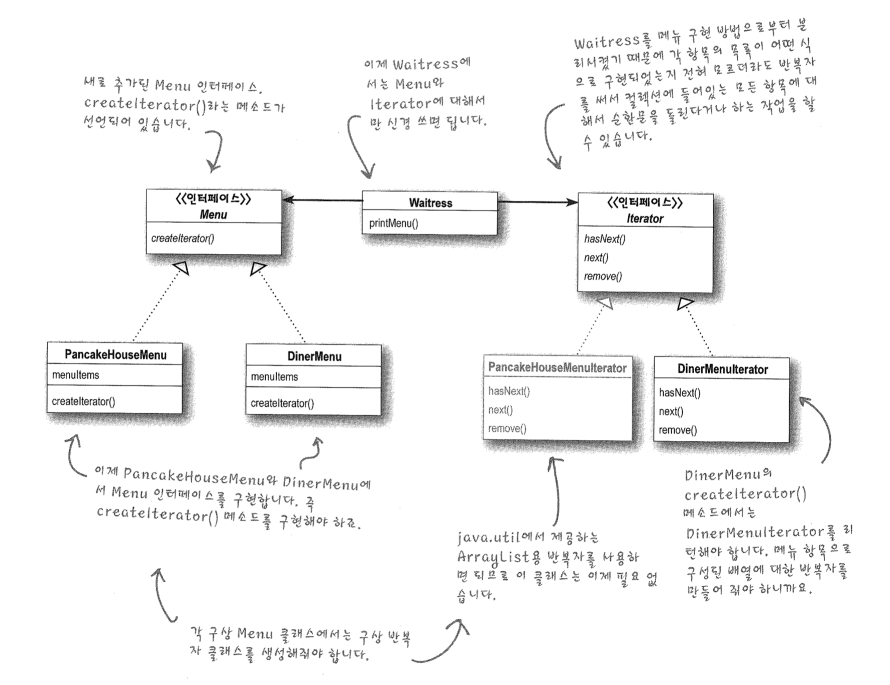
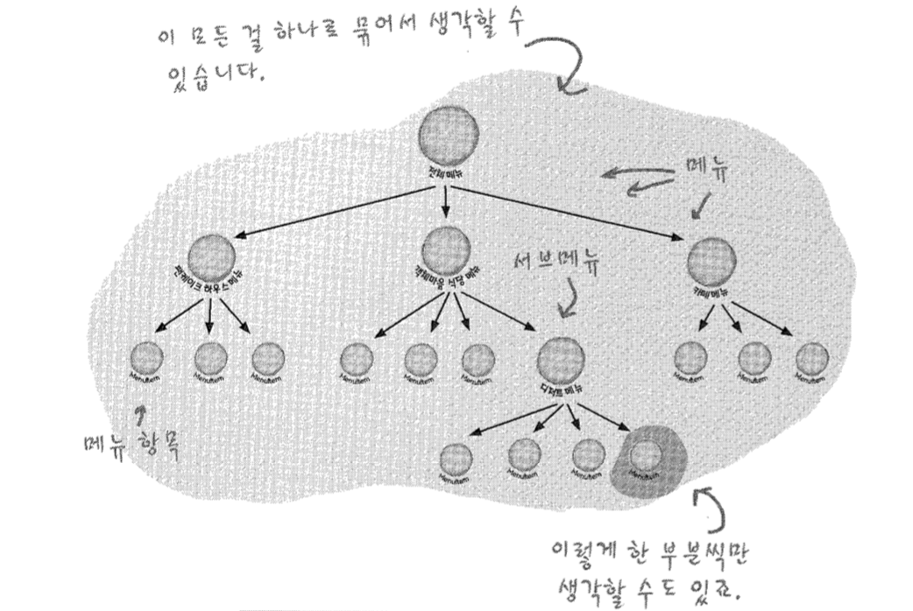
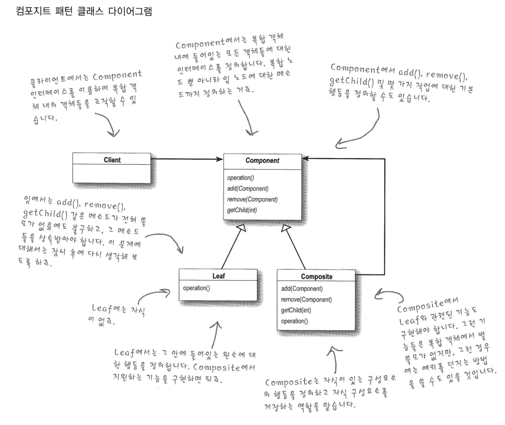
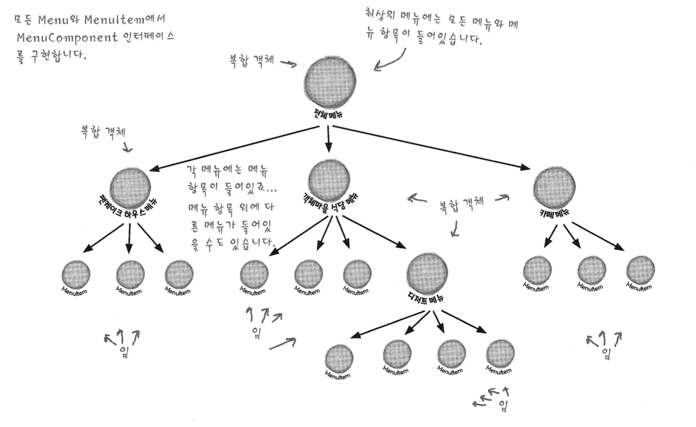

# Iterator & Composite Pattern

두 가지 서로 다른 표현 방식이 있다고 가정해 보자

- 두 메소드의 리턴 형식이 다르다
- 두개의 내용을 출력하기 위해서 두개의 순환문이 필요하다
- 반복 코드가 발생한다

그럼 어떻게 해야할까?

- 서로 다른 표현에 대해 공통된 인터페이스를 구현할 수 있다면!?
- 항목들에 대해 반복 작업을 수월하게 처리할 수 있는 방법은?
- 클라이언트가 항목이 어떤 식으로 구현되어있는지 알 필요가 없도록?


### Iterator Pattern

컬렉션 구현 방법을 노출시키지 않으면서도 그 집합체 안에 들어있는 모든 항목에 접근할 수 있게

해 주는 방법을 제공해 준다

```java
public class DinerMenuIterator implements Iterator{
  MenuItem[] items;
  int position = 0;
  
  public DinerMenuIterator(MenuItem[] items){
    this.items = items;
  }
  
  public Obejct next(){
    MenuItem menuItem = items[position];
    position = position + 1;
    return menuItem;
  }
  
  public boolean hasNext(){
    if(position >= items.length || items[position] == null){
      return false;
    } else{
      return true;
    }
  }
}
```

```java
public class DinerMenu{
  public Iterator createIterator(){
    return new DinerMenuIterator(menuItems);
  }
}
```

```java
public void printMenu(){
  Iterator itr = dinerMenu.createrIterator();
  print(itr);
}
```

- 배열, 리스트, 해시테이블..등 객체 컬렉션에 대해 반복자 구현 가능
- 구현법이 캡슐화 - 클라이언트 이밪ㅇ에서는 어떤 컬렉션을 어떤식으로 저장했는지 알필요 X
- Iterator만 구현하면 어떤 컬렉션이든 다형성을 활용하여 처리 가능


### Iterator Diagram



- 내부적인 구현 방법을 외부로 노출시키지 않으면서 집합체에 있는 모든 항목에 일일이 접근할 수 있음
- 항목에 일일이 접근할 수 있게 해주는 기능을 집합체가 아닌 반복자 객체에서 책임짐


#### 디자인 원칙

클래스를 바꾸는 이유는 한 가지 뿐이어야 한다

- 코드를 변경할 이유가 두가지가 되면 그만큼 그 클래스를 나중에 고쳐야 할 가능성이 커지게 됨


### Composite Pattern

객체들을 트리 구조로 구성하여 부분과 전체를 나타내는 계층구주로 만들 수 있다.

클라이언트에서 개발 객체와 다른 객체들로 구성된 복합 객체(composite)를 똑같은 방법으로 다룰 수 있다

- 객체의 구성과 개별 객체를 노드로 가지는 트리 형태로 객체를 구출할 수 있다

- 이런 복합 구조(composite structure)를 사용하면 복합 객체와 개별 객체에 대해 똑같은 작업을 적용할 수 있다
  즉 대부분의 경우에 복합 객체와 개별 객체를 구분할 필요가 없어짐

  

  





- Component
  - 구체적인 부분
  - Leaf 클래스와 전체에 해당하는 Composite 클래스에 공통 인터페이스를 정의
- Leaf
  - 구체적인 부분 클래스
  - Composite 객체의 부품으로 설정
- Composite
  - 전체 클래스
  - 복수 개의 Component를 갖도록 정의
  - 그러므로 복수 개의 Leaf, 복수 개의 Composite 객체를 부분으로 가질 수 있음