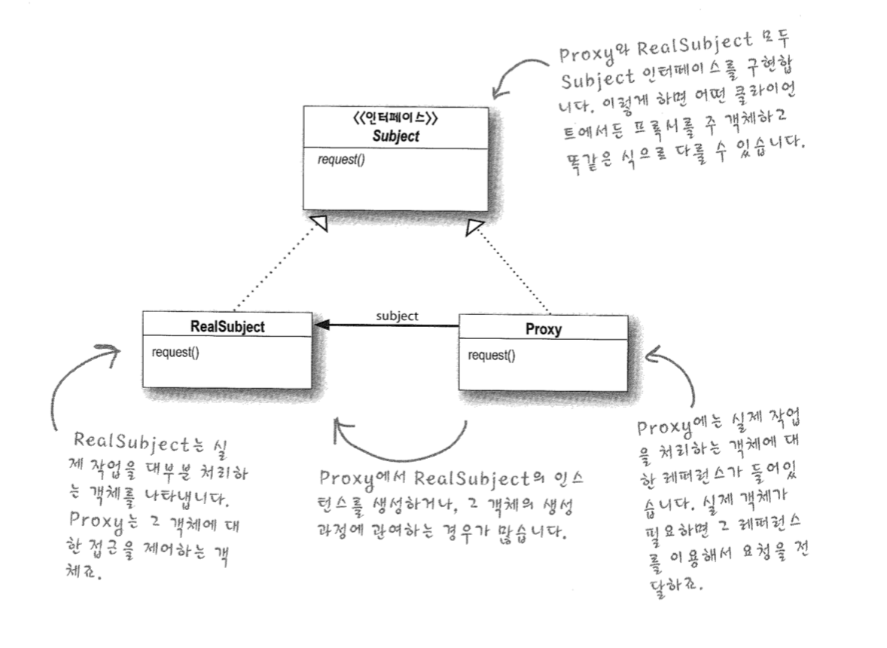
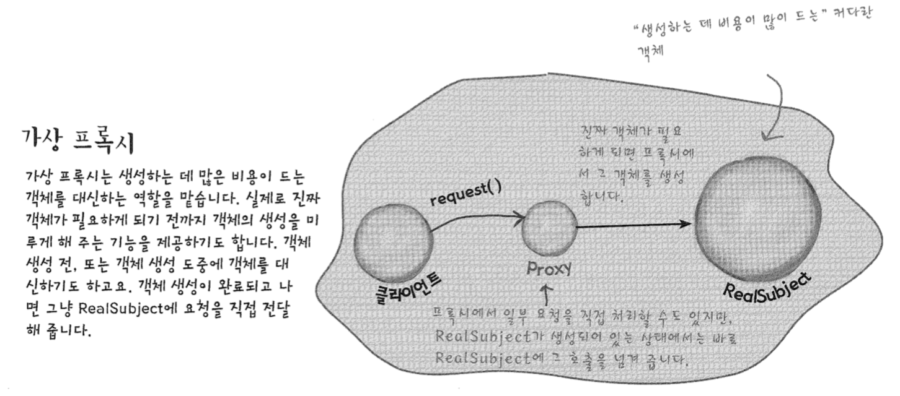
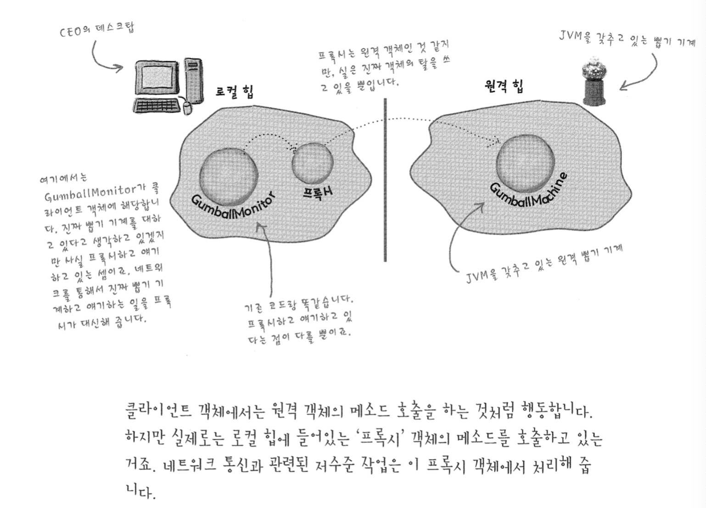
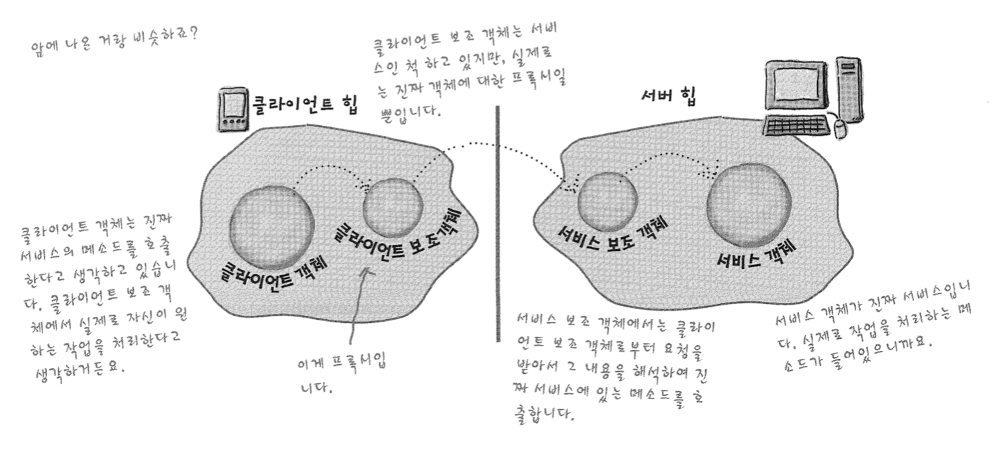
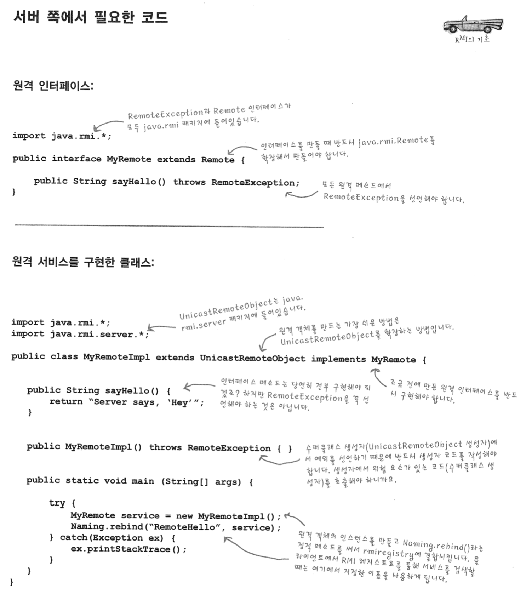
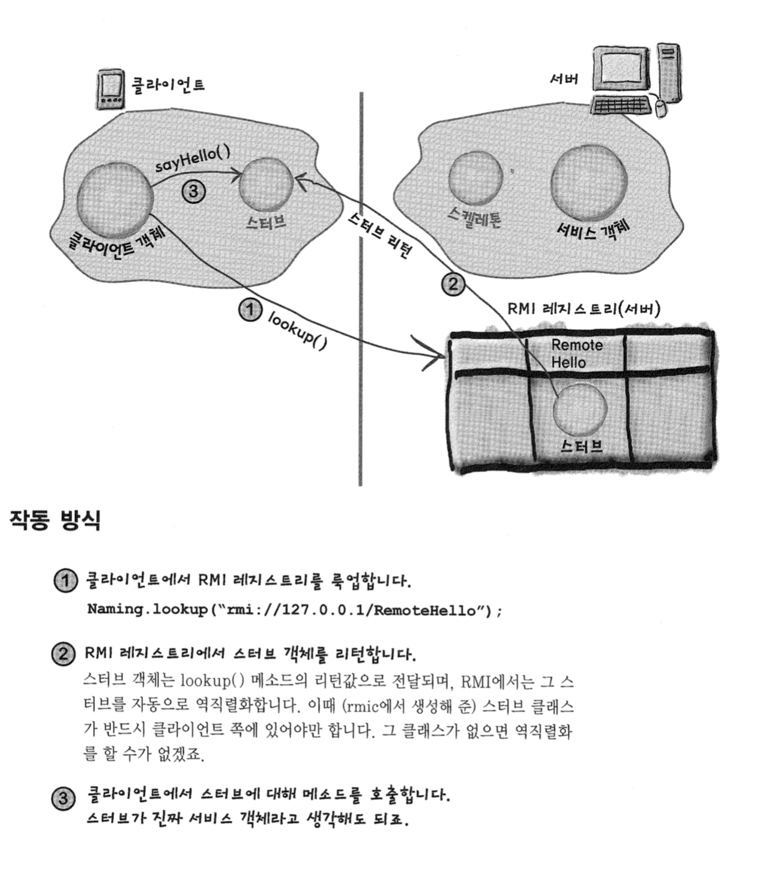
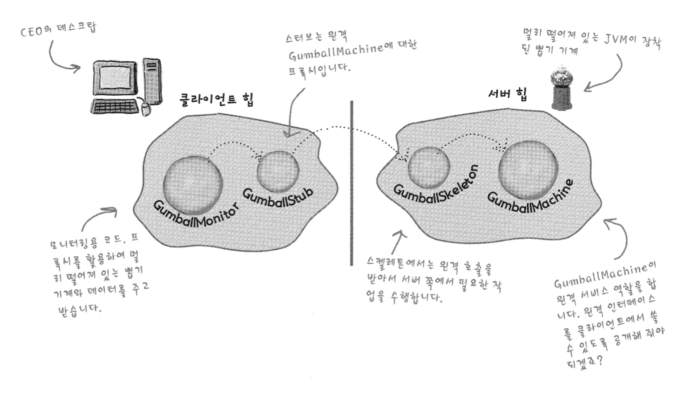

# Proxy Pattern

정의

어떤 객체에 대한 접근을 제어하기 위한 용도로 대리인이나 대변인에 해당하는 객체를 제공하는 패턴

#### 프록시에서 접근을 제어하는 방법

1. 원격 프록시를 써서 원격 객체에 대한 접근을 제어
2. 가상 프록시를 써서 생성하기 힘든 자원에 대한 접근을 제어
3. 보호 프록시를 써서 접근 권한이 필요한 자원에 대한 접근을 제어



- RealSubject는 실제 객체이며 실제 작업을 처리
- Proxy는 RealSubject 객체에 대한 대변인 역할
- 클라이언트는 Proxy를 통해서 RealSubject와 데이터를 주고 받음
- Proxy는 RealSubject 객체에 대한 접근 제어 역할도 함


----

#### 가상 프록시(Virtual Proxy)



- 가상 프록시는 생성하는 데 많은 비용이 드는 객체를 대신하는 역할
- 실제로 객체가 필요하게 되기 전까지 객체의 생성을 미루는 기능도 제공

----

#### 원격 프록시(Remote Proxy)




- 원격 프록시는 원격 객체에 대한 로컬 대변자 역할
- 원격 객체(remote proxy) : 다른 자바 가상 머신의 heap에서 살고 있는 객체
- 로컬 대변자(local representative) : 로컬 대변자의 메소드를 호출하면 다른 원격 객체한테 그 메소드 호출을 전달 
- 프록시는 원격 객체인 것 같지만 실은 진짜 객체의 탈을 쓰고 있다
- 클라이언트 GumbalMonitor 객체는 원격 객체의 메소드 호출을 하는 것처럼 보이지만, 
  로컬 힙에서 돌아가는 '프록시' 객체의 메소드를 호출하고 있는 것이다
- 네트워크 통신과 관련된 저수준 작업은 프록시 객체에서 처리한다


#### RMI(Remote Method Invocation)?

원격 JVM에 있는 객체를 찾아서 해당 메소드를 호출할 수 있다




- 클라이언트 객체는 진짜 서비스의 메소드를 호출한다고 생각
- 클라이언트 보조 객체는 서비스인 척 하지만, 진짜 객체에 대한 프록시 역할
- 서비스 보조 객체는 클라이언트 보조 객체로부터 요청을 받고 그 내용을 해석하여 진짜 서비스에 있는 메소드를 호출
- 서비스 객체가 진짜 서비스, 실제로 작업을 처리하는 메소드를 가지고 있다


#### 1. 원격 인터페이스 만들기

1. java.rmi.Remote를 확장

   ```java
   public interface MyRemote extends Remote{
    //Remote를 확장 -> 해당 인터페이스에서 원격 호출을 지원할 것임을 명시
   }
   ```

2. 모든 메소드를 RemoteException을 던지는 메소드로 선언

   ```java
   public interface myRemote extends Remote {
   	public String sayHello() throws RemoteException;
   }
   ```

   

   모든 원격 메소드 호출은 위험이 따르는 것이므로 RemoteException을 던져 클라이언트에서
   그 예외를 대비하도록 만들자

3. 인자와 리턴값은 반드시 원시 형식(primitive), 또는 Serializable 형식으로 선언

   - 메소드의 인자는 모두 네트워크를 통해서 전달
   - 직렬화를 통해 포장
   - 직접 만든 클래스를 사용할때는 Serializable interface를 구현하자

#### 2. 서비스 구현 클래스 만들기

1. 원격 인터페이스를 구현
   클라이언트에서 원격 인터페이스에 있는 메소드를 호출하기 때문에 
   서비스 클래스에서는 반드시 원격 인터페이스를 구현해야 한다

   ```java
   public class MyRemoteImpl extends UnicastRemoteObject implements MyRemote{
   	public String sayHello(){
   		return "hello, snow";
   	}
   }
   ```

2. UnicastRemoteObject를 확장
   원격 서비스 객체 역할을 하려면 객체에 '원격 객체가 되기 위한' 기능을 추가하여야 한다
   UnicastRemoteObject를 확장하여 그 수퍼클래스에서 제공하는 기능을 활용하자

   ```java
   public class MyRemoteImpl extends UnicastRemoteObject implements MyRemote{
   }
   ```

3. RemoteException을 선언하는 인자가 없는 생성자 만들기
   UnicastRemoteObject에는 한가지 문제점이 있다. 생성자에서 RemoteException을 던지는 것이다.

   이 문제를 해결하려면 서비스를 구현하는 클래스에서도 RemoteException을 선언하는 생성자를 만들어야 한다

   ```java
   public MyRemoteImpl() throws RemoteException {}		
   ```

4. 서비스를 RMI 레지스트리에 등록
   원격 서비스가 완성되고 나면 원격 클라이언트에서 쓸 수 있도록 RMI 레지스트리에 등록을 해야한다.

   ```java
   try{
   	MyRemote service = new MyRemoteImpl();
   	Naming.rebind("RemoteHello", service);
   } catch(Exception){...}
   ```

#### 3. 스터브 및 스켈레톤 생성

1. 서비스를 구현한 클래스에 대해서 rmic를 돌리기
   JDK에 포함되어 있는 rmic 툴은 서비스를 구현한 클랫스를 받아서 스터브와 스켈레톤 두 개의 새로운 클래스를 만듦

#### 4. rmiregistry 실행

1. 터미널을 새로 띄워서 rmiregistry를 실행

#### 5. 서비스 가동

1. 다른 터미널을 열고 서비스를 시작





---------------

#### 클라이언트에서는 어떻게 스터브 객체를 가져올 수 있을까?

- 클라이언트에서는 룩업(lookup)을 통해 스터브 객체를 요청
- 서비스를 등록할 때 사용한 이름을 적어주어야 함

```java
MyRemote service = (MyRemote) Naming.lookup("rmi://127.0.0.1/RemoteHello");
```




-----

#### GumballMachine을 원격 프록시로 개조



1.  GumballMachine용 원격 인터페이스를 만들고, 원격 클라이언트에서 호출할 수 있는 메소드들을 정의하기
2. 인터페이스의 모든 리턴 형식이 직렬화할 수 있는 형식인지 확인
3. 구상 클래스에서 인터페이스를 구현

