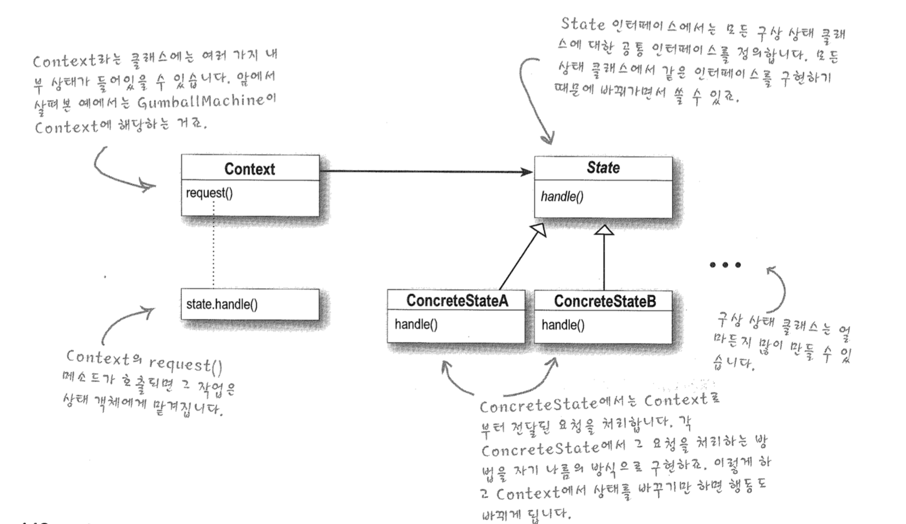

# State Pattern

각 상태의 행동을 별도의 클래스에 집어넣고 모든 상태에서 각각 자기가 할 일을 구현하도록 구현하자!

--> 구성을 활용

객체의 내부 상태가 바뀜에 따라서 객체의 행동을 바꿀 수 있다. 마치 객체의 클래스가

바뀌는 것과 같은 결과를 얻을 수 있다. 상태를 별도의 클래스로 캡슐화한 다음 현재 상태를 나타내는

객체에게 행동을 위임한다.

